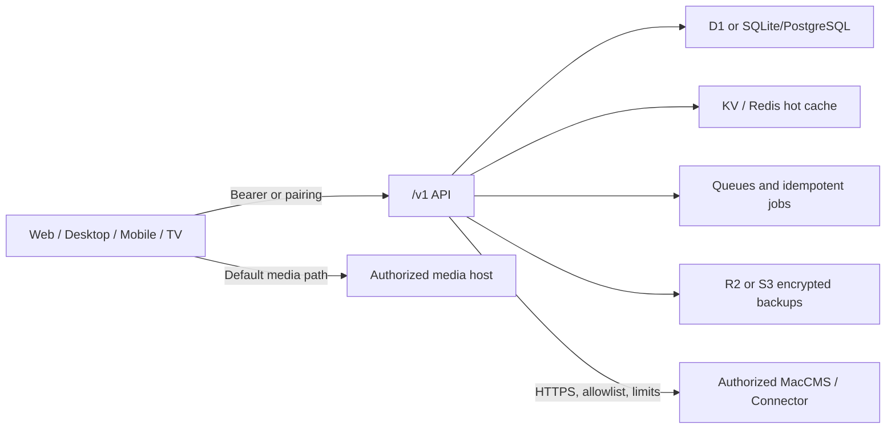

# Architecture

MarsTV 1.0 is one product with platform-specific clients and two interchangeable
server runtimes. `docs/openapi.yaml` is the public contract. Zod models in
`packages/contracts` are the executable boundary used by clients and servers.

## Trust boundaries

- Shared sources are encrypted by the service and readable only by Owner/Admin.
- Device-local sources stay in Keychain, Keystore, Stronghold, or SecureStore.
- Personal sync records are opaque ciphertext. The server merges HLC metadata
  without decrypting the payload.
- Catalog identity always retains `sourceId + sourceItemId`; title similarity is
  only a merge candidate and never merges playback URLs.

## Runtime mapping

The Cloudflare runtime uses D1 for authority, KV for expiring WebAuthn
challenges and hot caches, Durable Objects for pairing/rate/sync serialization,
Queues for probes, metadata and backups, and R2 for encrypted exports. The Node
runtime uses the same HTTP contract and a WAL SQLite store by default; production
operators can replace the storage interfaces with PostgreSQL, Redis, and S3.

MacCMS parsing is isolated in `packages/maccms`. It handles JSON/XML, the common
`ac=list|detail|videolist` variants, `$$$` line alignment, `#` episodes, and the
first `$` between label and URL.

## Player pipeline

1. Load an exact item from its source.
2. Select one exact episode/line; never infer a URL from a matching title.
3. Send a normalized resolver request to the built-in direct resolver or an
   allowlisted HTTPS connector.
4. Validate the final host after every redirect.
5. Return a short-lived `PlaybackManifest`.
6. Play HLS, DASH, or progressive media directly on the client by default.

Arbitrary JavaScript resolvers, embedded parsing iframes, DRM bypass, and
downloads are outside the 1.0 boundary.
